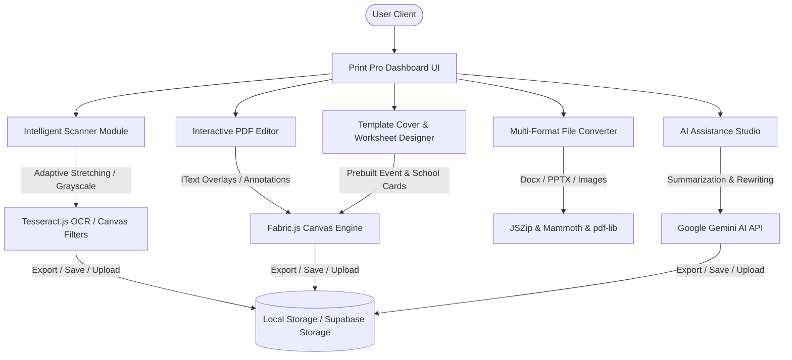

# Print Pro (برينت برو) 🖨️✨

[](https://opensource.org/licenses/MIT)
[](https://nextjs.org/)
[](https://www.typescriptlang.org/)
[](https://tailwindcss.com/)
[](https://github.com/MohamedOkash/print-pro-1.1/actions/workflows/ci.yml)

**Print Pro (برينت برو)** is a state-of-the-art, client-side, smart document platform engineered to simplify document management, design, and conversion. Designed specifically with Arabic language support in mind, it provides classroom teachers, professionals, and students with high-fidelity document scanning, editing, AI generation, and template-based sheet design tools.

---

## 🗺️ Architectural Workflow

Print Pro operates primarily client-side using advanced modern browser libraries. This keeps document operations lightning fast, cost-effective, and fully private.



---

## 🚀 Key Modules & Features

### 1. 📷 Intelligent Document Scanner (الماسح الضوئي الذكي)
*   **Smart Whitening (التبييض الذكي):** Custom adaptive stretch filters targeting faint stamp ink, pencil marks, and gray shadows, converting photos into crisp, printable black-on-white documents.
*   **Interactive Control:** Fine-tune scans using reactive brightness, contrast, and grayscale range sliders.
*   **Comparison Mode:** Live split-screen (before/after) view with a press-and-hold feature.
*   **Export Flow:** Converts pages to standard PDFs via client canvas, saving persistent history to local quotas with a link to "ملفاتي".

### 2. 🔄 Multi-Format Document Converter (محول الملفات المتكامل)
*   Supports seamless, client-side bidirectional conversion:
    *   **PDF to PowerPoint (PPTX)** (utilizing advanced custom layout generators).
    *   **PDF to Word (DOCX)** / Word to PDF.
    *   **Images to PDF / ZIP**.
*   All conversions happen client-side using highly optimized JSZip, Mammoth, and pdf-lib configurations.

### 3. ✍️ Professional PDF Editor (محرر PDF)
*   **Canva-style Editor:** Add text boxes, custom graphics, signatures, and annotations directly on top of uploaded PDFs.
*   **Original Text Manipulation:** Advanced white-out masking matched with editable IText overlays using pdf.js text coordinate maps.
*   **Adaptive Mount:** Lazy loading for the Fabric.js canvas to prevent interface freeze on large files.

### 4. 🎨 Graphic & Cover Designer (مصمم الأغلفة والبطاقات)
*   **Academic Templates:** High-quality predesigned school covers, homework grids, math worksheets, honor boards (7-rank ladder with gold frames), and timetables.
*   **Greetings & Invitation Cards:** Modern cards for graduations, Eid greetings, birthdays, wedding cards, posters, and thank-you notes.
*   **Layout Engine:** Responsive alignment tools, custom Arabic typography rendering, signature overlays, and vector graphics.

### 5. 🤖 AI Studio & Arabic PDF Exporter (استوديو الذكاء الاصطناعي)
*   **Powered by Google Gemini:** Write new content, correct spelling, summarize documents, and translate.
*   **Arabic PDF Fix:** Proprietary canvas-based RTL layout compiler that ensures Arabic text prints correctly without letter fragmentation (prevents typical jsPDF Helvetica mojibake).

### 6. 📁 Resilient Storage Manager (ملفاتي)
*   **Drag-and-Drop:** Intuitive file upload panel with validation and type restriction.
*   **Quota Resilient:** Local storage quota safety handlers that prevent app crash on full storage.
*   **Cloud Sync:** Optional backend integration with Supabase Storage for persistent multi-device access.

---

## 🛠️ Technology Stack

*   **Framework:** Next.js 14.2 (App Router)
*   **Styling:** Tailwind CSS + Lucide Icons + Framer Motion (staggered transitions)
*   **Languages:** TypeScript, JavaScript, CSS3
*   **Graphics & PDF engines:**
    *   [Fabric.js](http://fabricjs.com/) (v5.3) for canvas editing & sticker manipulation.
    *   [PDF.js](https://mozilla.github.io/pdf.js/) for rendering original PDFs onto interactive editor sheets.
    *   [pdf-lib](https://pdf-lib.js.org/) & `@cantoo/pdf-lib` for programmatic PDF modification.
*   **Authentication:** Firebase Auth (Email/Password & Google Sign-In)
*   **AI Integration:** Google Generative AI (Gemini SDK)

---

## ⚙️ Configuration & Environment Variables

Create a `.env.local` file in the root directory based on the following template (see [.env.example](file:///home/tarek/printpro/app/.env.example)):

```bash
# Supabase Keys (Optional)
NEXT_PUBLIC_SUPABASE_URL=your_supabase_url
NEXT_PUBLIC_SUPABASE_ANON_KEY=your_supabase_anon_key
SUPABASE_SERVICE_ROLE_KEY=your_supabase_service_role_key

# Gemini API Key (Required for AI Studio)
GEMINI_API_KEY=your_gemini_api_key
```

---

## 📦 Installation & Setup

1.  **Clone the Repository:**
    ```bash
    git clone https://github.com/MohamedOkash/print-pro-1.1.git
    cd print-pro-1.1
    ```

2.  **Install Project Dependencies:**
    ```bash
    npm install
    ```

3.  **Run Development Server:**
    ```bash
    npm run dev
    ```
    Open [http://localhost:3000](http://localhost:3000) in your browser to test local instance.

4.  **Lint & Code Quality Check:**
    ```bash
    npm run lint
    ```

5.  **Build Production Bundle:**
    ```bash
    npm run build
    ```

---

## 🤝 Contributing

Contributions make the open-source community amazing. Please read our [Contributing Guidelines](file:///home/tarek/printpro/app/CONTRIBUTING.md) to understand coding standards and the Pull Request submission process.

---

## 🛡️ License & Security

*   Distributed under the **MIT License**. See [LICENSE](file:///home/tarek/printpro/app/LICENSE) for more details.
*   For security vulnerability reports, please refer directly to our [Security Policy](file:///home/tarek/printpro/app/SECURITY.md).
